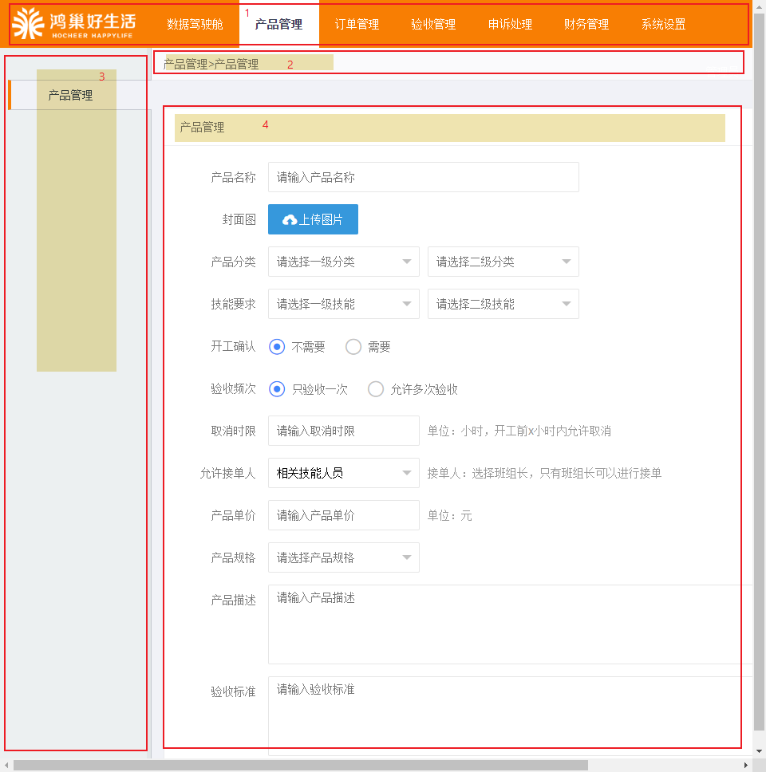
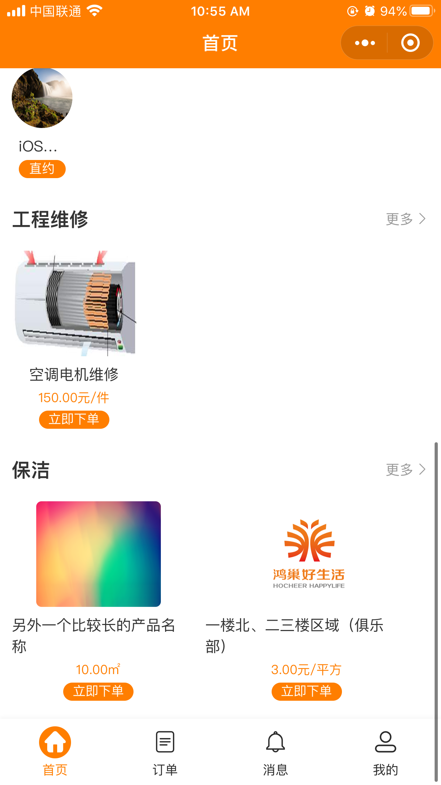

# 编写文档过程中“发现”的问题/想法
[TOC]

## :x: 先弄这个！

> 整个后台（总、培训、企业）按钮、显示文字/叫法等不一致，各自页面中的一些显示文字也有错误，因为比较分散各自查阅大家汇总在一起抓紧时间修改！！！

## 说明

列表中的重要等级：
- :x: D0级需要立即修改
- :warning: D1级可抽时间进行修复
- :bell: D4级查看先关内容并对其进行完善

## 总后台

### 系统设置
- [ ] 用户组管理
  - [ ] 是否应该加上搜索。
  - [ ] "权限配置"列表中的权限描述按钮方块宽度应该修改成: `width: auto`。
  - [ ] :warning: "权限配置"-"系统设置"中的`规则管理`, `添加规则`，`修改规则`以及`删除规则`需要隐藏起来。
- [ ] 管理员列表：
  - [ ] 是否需要加上搜索。
  - [ ] 后台用户是否应该加上联系方式，我感觉联系方式还是比较有必要的。
- [ ] 系统配置
  - [ ] 是否可以把小程序中“企业入驻入口文字”以及“服务人员入驻入口”文字以及“提现说明“文字放到基本配置中，这样集中文案（字）性内容在一起，其他的那些API配置功能单独在一起稍微好一些。
分类管理问题
- [ ] 服务分类管理
  - [x] :warning: ~~"服务分类管理"改成“产品分类管理”~~
  - [x] :x: ~~现有“服务分类管理”中没有重复判断，用户可以添加重复的分类~~

### 企业管理
- [ ] 待审核企业列表中最好可以加上搜索，方便对提交申请的企业进行检索。
- [ ] 因为企业的信息比较少，是否给企业多加几个字段，比如：如果企业有营业执照什么的加上这个信息，审批的时候也让企业提供一些辅助信息，可以在后台添加。
- [ ] :+1: 企业审批完成给企业生成一个独有的序列号，这样在区分企业的时候信息更加准确。
- [ ] :warning: 已审核企业：去掉删除操作

### 财务中心
- [ ] 提现管理： 个人感觉鸿嘉后台不太可能有人坐着一个人专门的一个一个的进行审核，尤其是当服务人员提现申请很多的时候, 所以应该添加多选或全选，然后批量审核。
- [ ] 考虑到对方打款操作应该是线下进行，因此可以按照时间段搜索后，导出已审批通过的数据表供线下人员使用。
- [ ] :question: 提现管理中的“审核”驳回后如何在进行其他操作，“驳回”的操作的主要作用是什么？
- [ ] 企业充值题外话：是否可以点击企业名称直接跳转到企业充值记录
- [ ] 审核服务人员提现的弹出窗中“提现金额”直接用文字表示，不要用`input`的形式比较好，感觉容易引起“误解”（我以为这个数字可以改呢:smile:)

### 广告管理
- [ ] :x: 广告列表状态栏中的“正常/锁定”按钮"无效"，点击确定后页面无反应，需刷新页面后才能看到修改效果

### 任务管理
- [ ] :warning: 后台显示上“任务管理”统一修改为“订单管理”比较合适

### 数据中心
- [ ] :x: :warning: 数据中心三个（企业、个人、服务人员）报表完全没有卵用！！！显示信息也不合适，且出现的跟消费、收入先关数据毛线用也没有。

### 验收申诉管理
- [ ] :question: 申诉申请详情处理中的作废订单……还没想好，不知道哪里有些不对劲:sweat_smile:

## 培训管理后台

- [ ] 产品管理
  - [x] :x: ~~产品管理中缺少首页推荐~~
  - [ ] :warning: 新增产品页面中可以隐藏掉“验收频次”选项，因为该选项只有一个显示出来也米有什么意义，还会引起客户的奇怪疑问
- [ ] 验收管理
  - [ ] :x: 验收管理搜索中的验收人placeholder文字内容写错了，抓紧时间修改一下
  - [ ] :warning: :bell: 后台中的文字描述尤其是更订单任务相关的，要不都改成订单，要不所有的都改成任务！

## 页面显示内容

- 显示内容依次从顶部菜单到左侧菜单栏到详细页面
- 如果顶部导航(1)页面中只有一个则不再显示左侧导航(3), 地址导航中只显顶部导航信息

- 时间类的搜索用日期就都用日期，用时间就都用时间；`placeholder`里面把“-”改成“开始-结束”

### 企业后台
- [x] "数据驾驶舱"
- [x] "产品管理"
  - [x] 点击"添加产品"按钮后页面（4）"添加产品" 
  - [x] 点击"详情"【原“修改”按钮改成“详情”】按钮后页面（4）显示“产品详情”
- [x] “订单管理”
  - [x] 搜索内容中“任务编号”改成“订单编号”（包括里面的默认placeholder文字）
  - [x] 订单列表列表头"任务编号"修改成“订单编号”
  - [x] 点击“发布订单”【原“发布任务”改成“发布订单”】按钮后页面（4）区域显示“发布订单”
  - [x] 发布订单页面中“上门时间”改成“开工时间”
  - [x] 点击“详情”按钮后页面（4）区域显示“订单详情”
    - [x] :question: 订单详情页面内容中"评价信息"没有显示内容，这里要什么信息？
- [ ] “验收管理”
  - [x] “验收人员管理”点击“添加验收人员”页面显示“添加验收人员”
  - [ ] :+1: "操作栏"中添加“详情”按钮（可以回验收人员信息做修改？）
  - [ ] :question: “验收人员管理”列表中有昵称和头像，这两个信息怎么显示
  - [x] “验收评价管理”页面（4）区域显示“验收评价管理”
  - [x] 搜索中：“任务编号”改成“订单编号”（以及`placeholder`中的内容）；验收人的`placeholder`“请输入任务编号”改成“请输入验收人”
  - [x] 验收评价管理列表表头“任务编号”改成“订单编号
- [ ] “申诉处理”
  - [x] 页面（搜索、表头）中的“任务编号”改成“订单编号”
  - [x] 点击“详情”按钮后的页面（4）区域“申诉”改成“申诉处理”
  - [x] 【接上一条】申诉处理页面中：第一部分为“申诉详情” 第二部分为“验收记录” :+1: 两个`form`都加上个段落标题稍微好些
- [x] 财务管理
  - [x] 搜索中的日期范围`placeholder`

### 总后台
- [x] “企业管理”
  - [x] “已审核企业”页面搜索中“电话”`placeholder`默认内容“请输入企业名称”修改为“请输入电话号码”
  - [x] :memo: 跟功能有些相关。“操作”栏中添加“详情”按钮，要不就把电话显示出来
  - [x] “待审核企业” 页面（4）部分为“企业入驻申请”:question: 这里点击“审核”按钮时弹窗形式
- [x] “用户管理”
  - [x] 点击“详情”页面（4）部分显示“用户个人信息”、“用户信息”、“用户详情”等
- [ ] “验收申诉管理”
  - [x] 搜索“申诉人”也加上默认的`placeholder`信息吧，比如“请输入申诉人名称”
  - [x] 点击“详情”后的页面参考企业后台“验收管理”点击详情
  - [x] “申诉申请”列表状态栏中加一个“已作废”状态
  - [x] “验收评价管理”搜索“任务编号和`palceholder`默认文字改成“订单编号”
  - [x] 列表中第一列“#”不知道是干什么的！“任务编号”改成“订单编号，验收人中“请输入任务编号”改成“请输入验收人名称”
  - [x] 点击“验收评价管理”列表中的详情页面（4）区域显示验收评价详情
- [x] “任务管理”改成“订单管理”；跟时间相关的搜索`placeholder`
- [x] “财务中心”: 跟时间相关的搜索`placeholder`
- [x] “广告管理”
  - [x] “新增”按钮按照管理改成“添加广告”
  - [x] 跟时间先关的搜索`placeholder`修改
  - [x] “删除”按钮颜色跟其他统一换成红色
  - [x] 点击“详情”按钮页面（4）位置“添加广告”改成“广告详情”
  - [x] :question: 详情中的“开关”是干什么用的？！如果有用改成是否显示，开关按钮中添加上“是/否”字样，可参考公告咨询详情页
  - [x] 搜索中的状态跟列表中对应一下：要不都用“正常/锁定”，要不都用“显示/隐藏”
- [ ] :question: “公告咨询管理” 是否改成“公告管理”
  - [x] 左侧导航中“内容管理”修改成“公告管理”
  - [x] “发布文章”按钮改成“添加公告”，点击“添加公告”按钮页面（4）区域显示“添加公告”
  - [x] 点击公告列表“详情按钮”（4）显示“公告详情”
  - [x] :question: 添加公告时以及公告详情里面的那个是否发布是不是应该跟列表里面对应起来“是否显示”
    - [x] 公告详情页中为“是否发布”， 公告管理列表野种显示“是否发布”，状态为“是/否”
- [ ] :sweat_smile: “数据中心”不作评论

### 培训后台
- [x] 产品管理
  - [x] “修改”修改成“详情”
  - [x] 点击“详情”按钮页面（4）部分为“产品详情”， 产品详情内容中“验收频次”去掉

### 小程序
- [x] 企业管理管理入口，发布订单，选择完产品后下一步中“上门时间”改成“开工时间”，“验收时间”改成“结束时间”
- [x] 产品名称过长后首页中显示有问题(如图)

|一个产品|多个产品|
|:-:|:-:|
|||
|||
